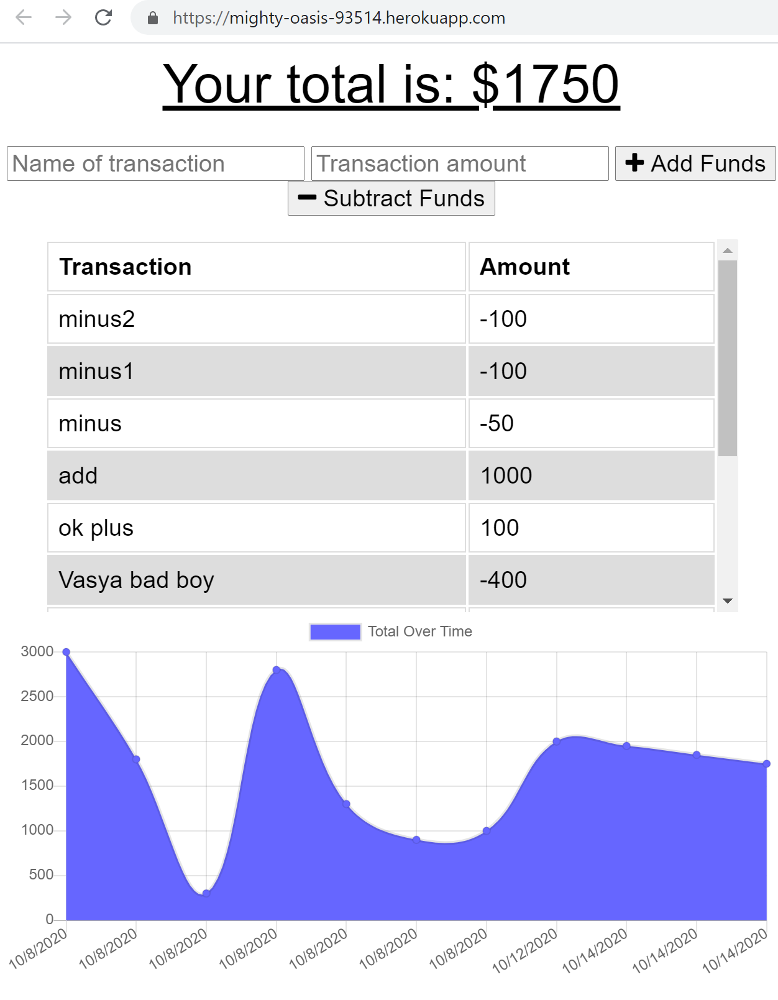

# Online/Offline Budget Trackers 
## Description 
Added functionality to existing Budget Tracker
### User Story
AS AN avid traveller
I WANT to be able to track my withdrawals and deposits with or without a data/internet connection
SO THAT my account balance is accurate when I am traveling

The user will be able to add expenses and deposits to their budget with or without a connection. 
When entering transactions offline, they should populate the total when brought back online.

Offline Functionality:

  * Enter deposits offline

  * Enter expenses offline

When brought back online:

  * Offline entries should be added to tracker.

## Table of Contents
* [Installation](#installation)
* [Usage](#usage)
* [License](#license)
* [Questions](#questions)
* [Review](#review)
## Installation 
 Clone the repo, and/or visit the deployed page link to begin. 
Link: [Online/Offline Budget Trackers](https://mighty-oasis-93514.herokuapp.com/)
## Usage 
Please input your expanses and deposit information. Even without internet it will be updated when access will be restored

 

## Contributing 
 None 
## License 
 Licensed under MIT License. 
## Tests 
 None
## Questions 
 You can see more of my Projects on my [GitHub profile](https://github.com/sbolotnikov) 

 Contact [sbolotnikov](mailto:sbolotnikov@gmail.com) 
## Review 
  * Here is this repo link: https://github.com/sbolotnikov/PWA-Budget-Tracker
 
  * Link: [Online/Offline Budget Trackers](https://mighty-oasis-93514.herokuapp.com/)